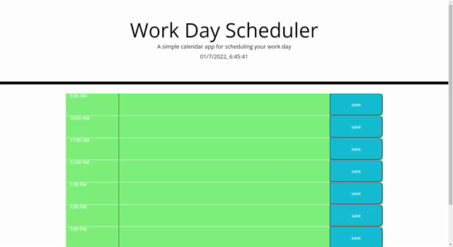

# work-day-scheduler

## Project Overview

Given a starter code for this website, this project was given to implement momentjs to create containers that changes color depending on if that specific container either has passed, is currently, or have yet to be on time. This work day scheduler is a calander app that is specific to current day between the hours of 9am to 5pm.  

## Installation

Tools Needed:

1. Terminal (MacOS) or
   [GitBash](https://gitforwindows.org/) (Windows)
2. Have a Github account (Not Required)
3. Install text editor of your choice (e.g. VSCode, Atom, etc.)

How to view the project:

1. Navigate in terminal/gitbash where you want to save the project
2. Clone the project via HTTPS or SSH link found in my GitHub repo 
    https://github.com/plotinusspascual/work-day-scheduler
3. After entering the command 'git clone [HTTPS/SSH Link]' in terminal, use command 'code .' to open the project in your default text editor
4. Right click on 'Index.html' and view in live browser to see the website 

## Features

- When timeblocks are viewed for the current day, each timeblock is color coded to indicate whether it is in the past, present, or future
- When timeblock is clicked, user can enter an event
- Save button saved the event within the timeblock and is saved in local storage
- Current time is displayed on top of the page that displays current time every second

## Images 

Below is a gif showcasing some of the elements and functions of my website. 

## Built With

* [HTML](https://developer.mozilla.org/en-US/docs/Web/HTML)
* [CSS](https://developer.mozilla.org/en-US/docs/Web/CSS)
* [Javascript](https://developer.mozilla.org/en-US/docs/Web/Javascript)
* [JQuery](https://developer.mozilla.org/en-US/docs/Web/Jquery)

## Deployed Link

* [See Live Site]( https://plotinusspascual.github.io/work-day-scheduler/)

## Authors

* **Jose Pascual** 

- [Link to Github](https://github.com/plotinusspascual)
- [Link to LinkedIn](https://www.linkedin.com/in/jose-plotinuss-pascual/)

## License

This project is licensed under the MIT License 

## Contributing

If there are anything I missed or could have done more efficiently please feel free to message me directly through Github

© 2021 Trilogy Education Services, LLC, a 2U, Inc. brand. Confidential and Proprietary. All Rights Reserved.